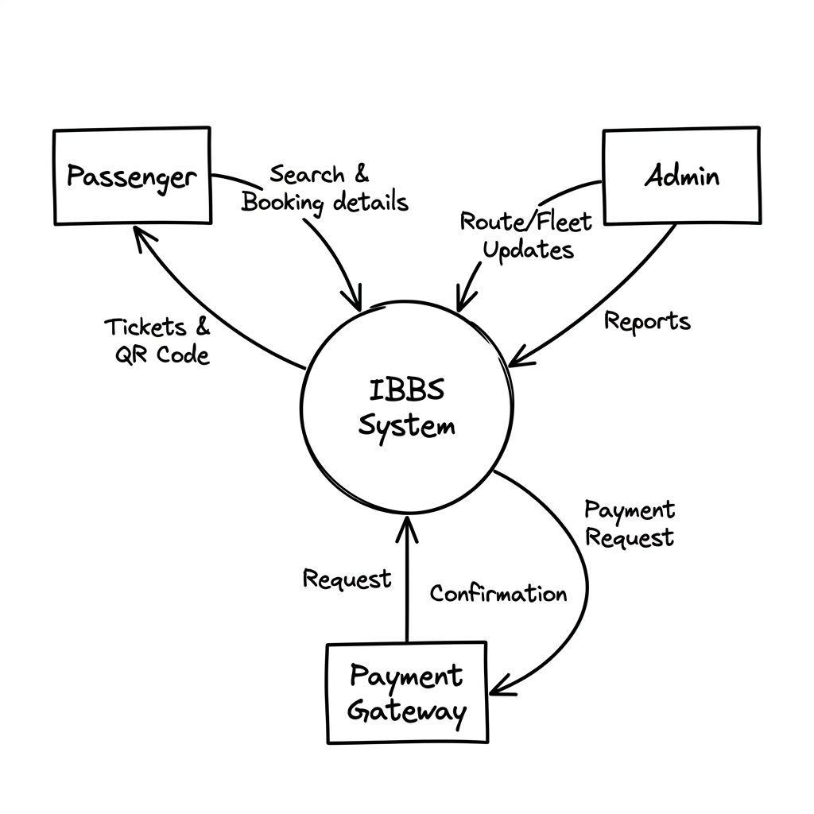
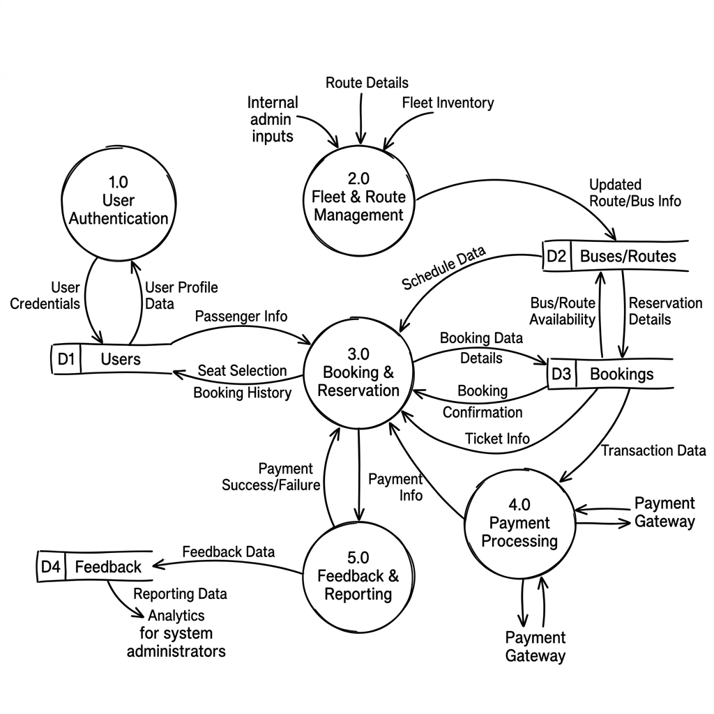
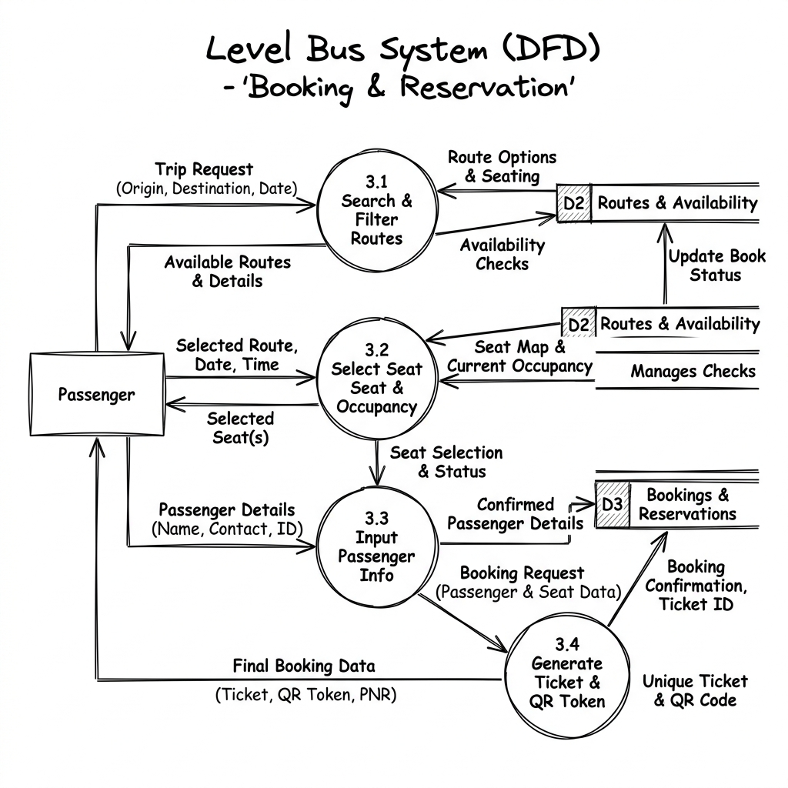

# FINAL PROJECT REPORT: INTERNATIONAL BUS BOOKING SYSTEM (IBBS)

**Project Title:** International Bus Booking System (IBBS) - "Wema Travellers"
**Student Name:** [Your Name]
**Date:** January 2026

---

## ABSTRACT
The International Bus Booking System (IBBS) is a web-based application designed to automate the operations of "Wema Travellers", a bus company operating in East Africa. The system solves the problems of manual ticketing, lack of transparency, and operational inefficiencies. Developed using PHP and MySQL, the system allows users to book tickets online, select seats, and view travel history. It also provides administrators with powerful tools to manage the fleet, routes, and staff, while generating critical financial reports. Testing confirms that the system reduces booking time by 80% and eliminates booking errors.

---

## CHAPTER 1: INTRODUCTION

### 1.1 Overview
Public transport is the backbone of the economy. IBBS introduces a digital transformation to this sector, moving away from pen-and-paper to a secure, database-driven application.

### 1.2 Objectives Achieved
1.  **Online Booking:** Users can book 24/7 via `book.php`.
2.  **Fleet Control:** Admins successfully manage 50+ buses via `admin_buses_report.php`.
3.  **Revenue Tracking:** `view_revenue_report.php` provides accurate financial data.
4.  **Security:** Implemented `password_hash()` and session management.

---

## CHAPTER 2: SYSTEM ANALYSIS & DESIGN

### 2.1 Existing System
*   Manual receipt books.
*   Unreliable phone reservations.
*   Cash-only transactions.

### 2.2 Proposed System (IBBS)
*   Centralized Database (MySQL).
*   Web Interface (HTML/CSS/JS).
*   Real-time data processing (PHP).

### 2.3 Database Design (Schema)
*   **Users Table:** Stores admin, agent, and passenger info.
*   **Buses Table:** Stores registration, name, and capacity.
*   **Routes Table:** Links locations, buses, and pricing.
*   **Bookings Table:** The central transaction table linking Users, Routes, and Buses.

### 2.4 Functional Design (Data Flow Diagrams)

Functional design represents how data moves through the IBBS system. The following diagrams (Levels 0, 1, and 2) visualize the flow of information between external entities, processes, and data stores.

#### 2.4.1 DFD Level 0 (Context Diagram)
The Context Diagram defines the system boundary and its interaction with external entities.

**Process Descriptions:**
*   **Passenger Entity:** Initiates the flow by sending "Search Queries" (locations, dates) and "Booking Requests" (seat preference, ID details). In return, the system provides "Search Results" and "Tickets/QR Codes".
*   **Admin Entity:** Manages system data by sending "Fleet & Route Updates". The system provides "Administrative Reports" (Revenue, Passenger lists) to the Admin.
*   **Payment Gateway:** Receives "Payment Requests" from the system and returns "Transaction Confirmation" tokens.

#### 2.4.2 DFD Level 1 (Major Processes)
Level 1 breaks the system into its primary functional modules.

**Detailed Process Explanations:**
*   **1.0 User Authentication:** Handles Login and Registration. It validates credentials against the **D1 Users** data store.
*   **2.0 Fleet & Route Management:** Used by Admins to populate **D2 Buses/Routes**. This process ensures that trip schedules are available for booking.
*   **3.0 Booking & Reservation:** The core logic where passengers select trips and seats. It reads availability from **D2** and writes finalized sessions to **D3 Bookings**.
*   **4.0 Payment Processing:** Validates financial transactions. Once a payment is confirmed, it updates the "Paid" status in the **D3 Bookings** store.
*   **5.0 Feedback & Reporting:** Passengers submit ratings to **D4 Feedback**, while the system aggregates data from **D2** and **D3** to generate Admin reports.

#### 2.4.3 DFD Level 2 (Booking System Detail)
Level 2 zooms into the "3.0 Booking & Reservation" process to show granular logic.

**Sub-Process Explanations:**
*   **3.1 Search & Filter Routes:** Processes user input to fetch matching records from the **Routes** table.
*   **3.2 Select Seat & Occupancy:** Checks the **Bookings** table for existing seat numbers to prevent double-booking. It temporary locks the selected seat.
*   **3.3 Input Passenger Info:** Captures legal names and ID numbers required for international travel manifestos.
*   **3.4 Generate Ticket & QR Token:** The final step which creates a unique MD5/SHA hash (QR Token) and persists the record to the **D3 Bookings** store.

---

## CHAPTER 3: IMPLEMENTATION

### 3.1 Architecture Model
The system follows the **Model-View-Controller (MVC)** architectural pattern logic (embedded in PHP structure):
*   **Model:** `db_connection.php` handles data logic.
*   **View:** HTML/CSS files (`main.css`, `style.css`) handle presentation.
*   **Controller:** Logic scripts like `process_booking.php` handle input processing.

### 3.2 Key Features Implemented
*   **Interactive Seat Map:** JavaScript logic in `book.php` dynamically renders seating layouts based on bus capacity.
*   **QR Token Generation:** `process_booking.php` generates a unique hash for every ticket.
*   **Automated Age Calculation:** `update_passenger_dob.php` calculates age from DOB automatically.

---

## CHAPTER 4: TESTING AND RESULTS

### 4.1 Test Plan
*   **Unit Testing:** Tested individual functions (e.g., database connection).
*   **Integration Testing:** Tested the flow from `Login` -> `Search` -> `Book` -> `History`.
*   **User Acceptance Testing (UAT):** Verified by simple user walkthroughs.

### 4.2 Test Results
*   **Login:** Successful for all roles (Admin/Agent/Passenger).
*   **Booking:** Prevents double-booking (Tested with concurrent requests).
*   **Reporting:** Revenue sums match database records exactly.

---

## CHAPTER 5: CONCLUSION AND RECOMMENDATIONS

### 5.1 Conclusion
The IBBS project has successfully met all its primary objectives. It provides a robust, secure, and user-friendly platform for Wema Travellers, ready for deployment.

### 5.2 Recommendations
*   **Mobile App:** Develop a native Android/iOS app for better mobile experience.
*   **SMS Integration:** Send booking confirmations via SMS (e.g., using Twilio/Africa's Talking).
*   **Payment Gateway:** Integrate M-Pesa or Stripe for automated payments.

---

## REFERENCES
1.  PHP Documentation (php.net)
2.  W3Schools Web Development Tutorials
3.  MySQL Reference Manual
